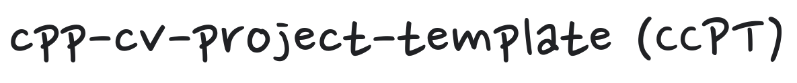

> "It's never been easier than this!"

## Purpose :fire:

This repo contains a C++ project template for developing computer vision applications.

## Features :star2:

> Currently, this repo is going under a rigorous change! Stay tuned for a big update!

- The project comprise a widely-used C++ project structure.
- The project supports installing essential toolchains for C++ programming and debugging.
   - git, build-essentials, cppcheck, cmake, clang, gcc, clang-tools, clang-tidy, lldb, lld, libc++, libomp (:heavy_check_mark:)
- The project supports the following 3rdParty libraries:
   - Python3 + basic packages (numpy, pandas, matplotlib, jupyter notebook, voila, tqdm, nbconvert) (:heavy_check_mark:)
   - Open3D - Python only for now (:heavy_check_mark:)
   - Eigen (:heavy_check_mark:)
   - OpenCV (:heavy_check_mark:)
      - Non-free algorithms currently disabled
   - Ceres-solver (:heavy_check_mark:)
   - GTSAM (:heavy_check_mark:)
   - Pangolin (:heavy_check_mark:)
   - PCL (:heavy_check_mark:)
      - Visualization disabled
   - OpenGL (:heavy_check_mark:)
- The project supports various tools to make good C++ project practices.
   - GTest (:heavy_check_mark:)
   - spdlog (:heavy_check_mark:)
   - fast-cpp-csv-parser (:heavy_multiplication_x:)
   - nlohmann-json (:heavy_multiplication_x:)

Status legend:
:heavy_check_mark: - Fully supported, 
:white_check_mark: - Partially supported / Build-only, 
:heavy_multiplication_x: - Not supported yet

## How to use :book:

>You need [Python3](https://www.python.org/) to use the automation scripts for project setup and build.

### Linux

```bash
# Install Python 3 and required modules
sudo apt install python3 python3-pip
pip3 install pyyaml gitpython

# Edit `setup_config.yaml` to configure project
gedit ./thirdparty/packages.yaml

# Install dependencies
./build_dependencies.py
```

- Edit the [packages.yaml](./thirdparty/packages.yaml) file to configure your project dependencies.
- You can also use the optional `--password YOUR_PASSWORD` argument to avoid manually typing your Linux password for every internal sudo command usage.
- You can also use the optional `--d` argument to also build debug libraries.
- You can also use the optional `--system` argument to build inside the system.

### Windows

- For now, Windows native build is not supported. Instead, you may use [Windows Subsystems for Linux (WSL)](https://docs.microsoft.com/en-gb/windows/wsl/install-win10) to use the build scripts.

### MacOS

- For now, MacOS native build is not supported.

## License :bank:

This repo is licensed under MIT license. Click [here]([./LICENSE](https://github.com/changh95/cpp-cv-project-template/blob/main/LICENSE)) to view the license.

## Contributors :sunglasses:

Thanks goes to these wonderful people!

<!-- ALL-CONTRIBUTORS-LIST:START - Do not remove or modify this section -->
<!-- prettier-ignore-start -->
<!-- markdownlint-disable -->
<table>
  <tr>
    <td align="center"><a href="https://github.com/changh95"><br /><sub><b>changh95</b></sub></a><br /><a href="https://github.com/changh95/cpp-cv-project-template/commits?author=changh95" title="Commits">💻</a></td>
    <td align="center"><a href="https://github.com/pacientes"><br /><sub><b>pacientes</b></sub></a><br /><a href="https://github.com/changh95/cpp-cv-project-template/commits?author=pacientes" title="Commits">💻</a></td>
    <td align="center"><a href="https://github.com/gst"><br /><sub><b>gst</b></sub></a><br /><a href="https://github.com/changh95/cpp-cv-project-template/commits?author=gst" title="Commits">💻</a></td>
  </tr>
</table>


<!-- markdownlint-restore -->
<!-- prettier-ignore-end -->

<!-- ALL-CONTRIBUTORS-LIST:END -->
